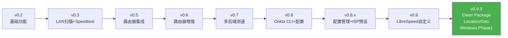

# netwatch-cli 当前阶段审计报告

> 审计时间：2026-07-12  
> 审计版本：`0.9.3`（[pyproject.toml](file:///Users/y4n9/Workspace/Projects/My-github-projects/netwatch-cli/pyproject.toml) / [__init__.py](file:///Users/y4n9/Workspace/Projects/My-github-projects/netwatch-cli/netwatch/__init__.py)）  
> 分支：`main`，47 commits，working tree clean  
> 许可证：MIT（[LICENSE](file:///Users/y4n9/Workspace/Projects/My-github-projects/netwatch-cli/LICENSE)）

---

## 1. 健康检查 ✅

| 检查项                          | 结果                               |
| ------------------------------- | ---------------------------------- |
| `python -m compileall netwatch` | ✅ 全部通过，无语法/编译错误        |
| `python -m pytest -q`           | ✅ **290 passed**，0 failed，19.50s |
| `git diff --check`              | ✅ 无空白差异                       |
| `git status`                    | ✅ clean，无未提交修改              |

---

## 2. 代码规模统计

### 源代码（netwatch/）

| 模块                                                                                            | 行数       | 核心文件                                                                                                                                                                                                                                                                                                                                                                                                                                                                                                                                                               |
| ----------------------------------------------------------------------------------------------- | ---------- | ---------------------------------------------------------------------------------------------------------------------------------------------------------------------------------------------------------------------------------------------------------------------------------------------------------------------------------------------------------------------------------------------------------------------------------------------------------------------------------------------------------------------------------------------------------------------- |
| **cli_modules/**                                                                                | ~1,302     | [speedtest.py](file:///Users/y4n9/Workspace/Projects/My-github-projects/netwatch-cli/netwatch/cli_modules/speedtest.py)(894), [location.py](file:///Users/y4n9/Workspace/Projects/My-github-projects/netwatch-cli/netwatch/cli_modules/location.py)(283), [router.py](file:///Users/y4n9/Workspace/Projects/My-github-projects/netwatch-cli/netwatch/cli_modules/router.py)(203), [lan.py](file:///Users/y4n9/Workspace/Projects/My-github-projects/netwatch-cli/netwatch/cli_modules/lan.py)(167)                                                                     |
| **speedtest/**                                                                                  | ~1,299     | [speedtest_cn_browser.py](file:///Users/y4n9/Workspace/Projects/My-github-projects/netwatch-cli/netwatch/speedtest/speedtest_cn_browser.py)(363), [runner.py](file:///Users/y4n9/Workspace/Projects/My-github-projects/netwatch-cli/netwatch/speedtest/runner.py)(362), [speedtest_cn.py](file:///Users/y4n9/Workspace/Projects/My-github-projects/netwatch-cli/netwatch/speedtest/speedtest_cn.py)(304), backends(~469)                                                                                                                                               |
| **network/**                                                                                    | ~881       | [router.py](file:///Users/y4n9/Workspace/Projects/My-github-projects/netwatch-cli/netwatch/network/router.py)(449), [info.py](file:///Users/y4n9/Workspace/Projects/My-github-projects/netwatch-cli/netwatch/network/info.py)(185), [scanner.py](file:///Users/y4n9/Workspace/Projects/My-github-projects/netwatch-cli/netwatch/network/scanner.py)(174)                                                                                                                                                                                                               |
| **location/**                                                                                   | ~1,257     | [boundary_stress.py](file:///Users/y4n9/Workspace/Projects/My-github-projects/netwatch-cli/netwatch/location/admin/boundary_stress.py)(362), [device.py](file:///Users/y4n9/Workspace/Projects/My-github-projects/netwatch-cli/netwatch/location/geolocation/device.py)(312), [boundary_tools.py](file:///Users/y4n9/Workspace/Projects/My-github-projects/netwatch-cli/netwatch/location/admin/boundary_tools.py)(264), [offline_boundary.py](file:///Users/y4n9/Workspace/Projects/My-github-projects/netwatch-cli/netwatch/location/admin/offline_boundary.py)(235) |
| **platform/**                                                                                   | ~606       | [windows.py](file:///Users/y4n9/Workspace/Projects/My-github-projects/netwatch-cli/netwatch/platform/windows.py)(332), [base.py](file:///Users/y4n9/Workspace/Projects/My-github-projects/netwatch-cli/netwatch/platform/base.py)(215)                                                                                                                                                                                                                                                                                                                                 |
| **core/**                                                                                       | ~226       | [config.py](file:///Users/y4n9/Workspace/Projects/My-github-projects/netwatch-cli/netwatch/core/config.py)(131), [banner.py](file:///Users/y4n9/Workspace/Projects/My-github-projects/netwatch-cli/netwatch/core/banner.py)(94)                                                                                                                                                                                                                                                                                                                                        |
| [cli.py](file:///Users/y4n9/Workspace/Projects/My-github-projects/netwatch-cli/netwatch/cli.py) | 244        | 主菜单入口                                                                                                                                                                                                                                                                                                                                                                                                                                                                                                                                                             |
| **总计**                                                                                        | **~7,167** |                                                                                                                                                                                                                                                                                                                                                                                                                                                                                                                                                                        |

### 测试代码（tests/）

| 测试模块       | 行数       | 核心文件                                                                                                                                                                                                                                                                                                                                                                                                                                               |
| -------------- | ---------- | ------------------------------------------------------------------------------------------------------------------------------------------------------------------------------------------------------------------------------------------------------------------------------------------------------------------------------------------------------------------------------------------------------------------------------------------------------ |
| **speedtest/** | ~2,418     | [test_speedtest_backends.py](file:///Users/y4n9/Workspace/Projects/My-github-projects/netwatch-cli/tests/speedtest/test_speedtest_backends.py)(1413), [test_speedtest_cn.py](file:///Users/y4n9/Workspace/Projects/My-github-projects/netwatch-cli/tests/speedtest/test_speedtest_cn.py)(554), [test_speedtest_cn_browser.py](file:///Users/y4n9/Workspace/Projects/My-github-projects/netwatch-cli/tests/speedtest/test_speedtest_cn_browser.py)(451) |
| **location/**  | ~1,351     | [test_device_location.py](file:///Users/y4n9/Workspace/Projects/My-github-projects/netwatch-cli/tests/location/test_device_location.py)(779), [test_precise_location.py](file:///Users/y4n9/Workspace/Projects/My-github-projects/netwatch-cli/tests/location/test_precise_location.py)(293)                                                                                                                                                           |
| **network/**   | ~404       | [test_router.py](file:///Users/y4n9/Workspace/Projects/My-github-projects/netwatch-cli/tests/network/test_router.py)(366), [test_platform_windows.py](file:///Users/y4n9/Workspace/Projects/My-github-projects/netwatch-cli/tests/network/test_platform_windows.py)(228)                                                                                                                                                                               |
| **core/**      | ~218       | [test_config.py](file:///Users/y4n9/Workspace/Projects/My-github-projects/netwatch-cli/tests/core/test_config.py)(107), [test_banner.py](file:///Users/y4n9/Workspace/Projects/My-github-projects/netwatch-cli/tests/core/test_banner.py)(111)                                                                                                                                                                                                         |
| **dev/**       | 339        | [test_clean_caches.py](file:///Users/y4n9/Workspace/Projects/My-github-projects/netwatch-cli/tests/dev/test_clean_caches.py)                                                                                                                                                                                                                                                                                                                           |
| **compat/**    | 49         | [test_canonical_imports.py](file:///Users/y4n9/Workspace/Projects/My-github-projects/netwatch-cli/tests/compat/test_canonical_imports.py)                                                                                                                                                                                                                                                                                                              |
| **总计**       | **~5,465** | **290 tests**                                                                                                                                                                                                                                                                                                                                                                                                                                          |

### 文档

| 分类                        | 文件数                                                                                                                                                                                                                                                                                                   |
| --------------------------- | -------------------------------------------------------------------------------------------------------------------------------------------------------------------------------------------------------------------------------------------------------------------------------------------------------- |
| 版本计划 (`docs/plans/`)    | 10 个（v0.2 ~ v0.9.3）                                                                                                                                                                                                                                                                                   |
| 交接文档 (`docs/handoff/`)  | 3 个（Codex / Claude / DeepSeek）                                                                                                                                                                                                                                                                        |
| 功能设计 (`docs/features/`) | 1 个（speedtest.cn browser automation）                                                                                                                                                                                                                                                                  |
| 其他                        | [README.md](file:///Users/y4n9/Workspace/Projects/My-github-projects/netwatch-cli/README.md)(371L), [AGENTS.md](file:///Users/y4n9/Workspace/Projects/My-github-projects/netwatch-cli/AGENTS.md)(56L), [CLAUDE.md](file:///Users/y4n9/Workspace/Projects/My-github-projects/netwatch-cli/CLAUDE.md)(48L) |

### 总结

> 源码 7,167 行 + 测试 5,465 行 + 文档丰富。  
> 测试/源码比 ≈ **0.76**，覆盖良好。

---

## 3. 架构审计

### 包结构（Clean Package Mode）

```
netwatch/
├── cli.py                     # 主菜单入口（244L），薄调度层
├── cli_modules/               # CLI 交互/展示模块
│   ├── speedtest.py           # ⚠️ 894 行，是最大的单文件
│   ├── location.py            # 定位相关交互
│   ├── router.py              # 路由器相关交互
│   ├── lan.py                 # 局域网扫描交互
│   └── common.py              # 通用 helper
├── core/                      # banner, config
├── network/                   # 网络发现、路由器、代理探测
├── location/                  # 定位、行政区划、道路
│   ├── admin/                 # 边界、中心点、坐标转换
│   ├── geolocation/           # 浏览器授权定位
│   ├── roads/                 # 附近道路（实验）
│   └── data/                  # 内置轻量数据
├── speedtest/                 # 测速领域模块
│   ├── backends/              # Ookla / LibreSpeed / Python fallback
│   ├── speedtest_cn*.py       # speedtest.cn 自动化
│   ├── runner.py              # 调度
│   ├── analysis.py            # 一致性/路径分析
│   └── speed.py               # 实时流量采样
└── platform/                  # macOS / Linux / Windows 适配
```

### 分层合理性评估

| 评估维度                      | 状态   | 说明                                                                                        |
| ----------------------------- | ------ | ------------------------------------------------------------------------------------------- |
| CLI ↔ 业务逻辑分离            | ✅ 良好 | `cli.py` 是薄调度层，`cli_modules/` 负责展示，真实逻辑在 `core/network/speedtest/location/` |
| 测速后端返回结构化数据        | ✅ 符合 | backends 返回 `SpeedtestResult`，不直接 print                                               |
| 所有公网/subprocess 测试 mock | ✅ 符合 | 290 tests 全部 mock                                                                         |
| 敏感信息不落盘                | ✅ 符合 | config 只保存非敏感偏好                                                                     |
| 不逆向 speedtest.cn           | ✅ 符合 | 只做浏览器自动化 DOM 读取                                                                   |

### 潜在关注点

> [!WARNING]
> [cli_modules/speedtest.py](file:///Users/y4n9/Workspace/Projects/My-github-projects/netwatch-cli/netwatch/cli_modules/speedtest.py) 有 **894 行**，是项目中最大的单文件，集中了所有测速相关 CLI 展示逻辑。虽然当前仍在 CLI 层（符合分层规则），但如果继续增长可能需要拆分。

> [!NOTE]
> [test_speedtest_backends.py](file:///Users/y4n9/Workspace/Projects/My-github-projects/netwatch-cli/tests/speedtest/test_speedtest_backends.py) 有 **1,413 行**，是最大的测试文件。同样，后续如果继续增长可以按后端拆分。

---

## 4. 功能矩阵

### 主菜单（8 项）

| #   | 功能                     | 实现状态 | 关键模块                                |
| --- | ------------------------ | -------- | --------------------------------------- |
| 1   | 查看实时网卡流量         | ✅ 完整   | `speed.py` + Rich Live                  |
| 2   | 查看本机网络信息         | ✅ 完整   | `info.py` + `proxy_probe.py`，分层展示  |
| 3   | 局域网设备发现           | ✅ 完整   | `scanner.py` + Ping/ARP                 |
| 4   | 宽带测速（speedtest.cn） | ✅ 实验性 | Playwright DOM 自动化，失败不回退 Ookla |
| 5   | 代理/当前出口测速        | ✅ 完整   | 简洁输出 + 可选详细诊断                 |
| 6   | 打开路由器管理后台       | ✅ 完整   | 通用 URL + 小米/Redmi stok              |
| 7   | 高级功能（14 项子菜单）  | ✅ 完整   | 见下                                    |
| 8   | 退出                     | ✅        | —                                       |

### 高级功能子菜单（14 项）

| #   | 功能                                    | 状态                       |
| --- | --------------------------------------- | -------------------------- |
| 1   | 通用测速诊断（Ookla/LibreSpeed/Python） | ✅ 完整诊断                 |
| 2   | 指定 Ookla server id 测速               | ✅                          |
| 3   | 按关键词筛选 Ookla 服务器               | ✅                          |
| 4   | 按运营商/城市优选服务器                 | ✅ ISP 预设优化             |
| 5   | 保存最近成功测速服务器为默认            | ✅                          |
| 6   | 清除默认测速服务器                      | ✅                          |
| 7   | 查看当前测速配置                        | ✅                          |
| 8   | 显示最近测速摘要                        | ✅                          |
| 9   | 显示测速后端信息                        | ✅                          |
| 10  | Ookla server selection details          | ✅                          |
| 11  | LibreSpeed 自定义服务器列表             | ✅ server-json / local-json |
| 12  | 打开 speedtest.cn 网页对照              | ✅ webbrowser.open          |
| 13  | 浏览器授权 + 离线精确行政区定位         | ✅ 实验性                   |
| 14  | 返回主菜单                              | ✅                          |

### 测速后端优先级

```
1. Official Ookla CLI (/opt/homebrew/bin/speedtest)    — 默认通用后端
2. LibreSpeed CLI                                       — 开源备选
3. Python speedtest-cli                                 — fallback（可能偏低）
4. speedtest.cn browser automation (Playwright)         — 主菜单 4 独立入口
```

### 平台支持

| 平台       | 状态           | 说明                                   |
| ---------- | -------------- | -------------------------------------- |
| macOS      | ✅ 主开发平台   | 完整支持                               |
| Linux      | ✅ 支持         | 完整支持                               |
| Windows 11 | ⚠️ Experimental | Phase 1 平台后端已实现，有测试（228L） |

---

## 5. 版本演进回顾



**v0.9.3（当前）核心变更**：
- Clean package layout 重构（canonical packages）
- Location/geolocation 子系统整理（admin/boundary/roads）
- Windows phase 1 平台后端
- 广州行政边界 stress tests
- 实验性精确离线定位

---

## 6. 工程质量评估

### ✅ 做得好的

| 方面              | 详情                                                |
| ----------------- | --------------------------------------------------- |
| **测试覆盖**      | 290 个测试，全部 mock，测试/源码比 0.76             |
| **分层清晰**      | cli → cli_modules → core/network/speedtest/location |
| **文档完善**      | README 详尽，3 份交接文档，10 份版本计划            |
| **安全边界**      | 不存敏感信息，不逆向 API，测试全 mock               |
| **渐进演进**      | 47 commits，小步前进，每版有 plan                   |
| **多 Agent 协作** | Claude/Codex/DeepSeek 交接机制成熟                  |

### ⚠️ 待改进

| 方面                          | 详情                                                                                                   | 优先级   |
| ----------------------------- | ------------------------------------------------------------------------------------------------------ | -------- |
| **无 CI/CD**                  | 没有 `.github/workflows/`，缺少自动化构建和测试                                                        | P1       |
| **大文件风险**                | `cli_modules/speedtest.py`(894L)、`test_speedtest_backends.py`(1413L) 持续增长可能难维护               | P2       |
| **版本号滞后**                | `pyproject.toml` 和 `__init__.py` 均为 `0.9.3`，但 handoff 文档提到 V0.10.4/V0.10.5/V0.10.6 功能已实现 | P1       |
| **README 中说"许可证待补充"** | 实际 LICENSE 已存在（MIT），README 末尾说法过时                                                        | P2       |
| **commit message 规范**       | 部分早期 commit 如 `1`、`ce79276 1` 不符合规范                                                         | P3       |
| **`.DS_Store` 已提交**        | 多个 `.DS_Store` 文件存在于 Git 历史中                                                                 | P3       |
| **无 type checking**          | 没有 `mypy` / `pyright` 配置                                                                           | P3       |
| **speedtest.cn 实验性**       | 依赖页面 DOM 结构，可能随时失效                                                                        | 已知风险 |

---

## 7. 依赖审计

### 核心依赖（[pyproject.toml](file:///Users/y4n9/Workspace/Projects/My-github-projects/netwatch-cli/pyproject.toml)）

| 包                 | 版本要求 | 用途                        |
| ------------------ | -------- | --------------------------- |
| `psutil`           | ≥5.9     | 网卡流量采样                |
| `requests`         | ≥2.31    | 公网出口 IP 查询            |
| `rich`             | ≥13.0    | 终端 UI（表格、面板、进度） |
| `speedtest-cli`    | ≥2.1     | Python fallback 测速        |
| `reverse-geocoder` | ≥1.5.1   | 离线反向地理编码            |

### 可选依赖

| Group     | 包                | 用途                |
| --------- | ----------------- | ------------------- |
| `browser` | `playwright≥1.44` | speedtest.cn 自动化 |
| `dev`     | `pytest≥8.0`      | 测试                |
| `geo`     | `shapely≥2.0`     | 行政边界精确定位    |

> [!TIP]
> 依赖轻量合理，核心 5 个包，可选 3 个按需安装。

---

## 8. 当前禁忌清单（来自 [AGENTS.md](file:///Users/y4n9/Workspace/Projects/My-github-projects/netwatch-cli/AGENTS.md)）

- ❌ 不逆向 `speedtest.cn` 私有 API
- ❌ 不重新加入手动 speedtest.cn 录入
- ❌ 不让默认测试访问真实网站/启动真实浏览器
- ❌ 不提交 `~/.netwatch/debug/` 截图
- ❌ 不做大重构
- ❌ 不修改 `run_best_speedtest()` / `show_auto_speedtest()` 后端逻辑
- ❌ 主菜单 4 失败不自动 fallback Ookla
- ❌ 不存敏感信息（密码/stok/token/公网IP）

---

## 9. 下阶段建议

### P0（应优先处理）

| 任务                       | 说明                                                                                                              |
| -------------------------- | ----------------------------------------------------------------------------------------------------------------- |
| **同步版本号**             | 将 `pyproject.toml` 和 `__init__.py` 更新为反映当前实际功能的版本（如 `0.10.6`），或确认当前 `0.9.3` 是否有意保持 |
| **修复 README 许可证说明** | README 末尾"许可证待补充"已过时，LICENSE 文件已存在                                                               |
| **保持测试全绿**           | 当前 290 passed，持续维护                                                                                         |

### P1（短期改进）

| 任务                                   | 说明                                                  |
| -------------------------------------- | ----------------------------------------------------- |
| **添加 GitHub Actions CI**             | 至少 `pytest -q` + `compileall` 在 push/PR 时自动运行 |
| **speedtest.cn 进度改为 event-driven** | handoff 中标注的 P1 任务                              |
| **Windows 功能扩展**                   | Phase 1 完成，后续可扩展 LAN 扫描、路由器等           |

### P2（中期方向）

| 任务                             | 说明                                          |
| -------------------------------- | --------------------------------------------- |
| **HTTP file download test**      | 不依赖测速 CLI 后端的可控测速方向             |
| **iperf3 局域网/自控服务器测速** | 更可靠的带宽测量                              |
| **拆分大文件**                   | `cli_modules/speedtest.py`(894L) 可按功能拆分 |
| **添加 type checking**           | `mypy` 或 `pyright` 静态类型检查              |

### P3（长期愿景）

| 任务                      | 说明                        |
| ------------------------- | --------------------------- |
| **更丰富的 Windows 支持** | 完善 Windows 11 体验        |
| **国际化**                | 当前界面为中文，可考虑 i18n |
| **插件化测速后端**        | 统一后端接口，方便扩展      |
| **正式 speedtest.cn SDK** | 如果未来有官方 API 授权     |

---

## 10. 总结

`netwatch-cli` 当前处于 **功能丰富、架构清晰、测试完善** 的良好状态。

**核心指标**：
- 🏗️ **7,167 行源码** / **5,465 行测试** / **290 个测试全通过**
- 📦 **47 commits**，渐进演进，多 Agent 协作成熟
- 🛡️ 安全边界清晰，禁忌规则明确

**最需关注**：版本号同步、CI/CD 基础设施、大文件控制。

**项目定位准确**：轻量级 CLI 网络诊断工具，不追求成为完整的网络管理平台。当前功能集（网络信息、LAN 发现、多后端测速、路由器入口、离线定位）已经覆盖了日常排障的核心场景。
